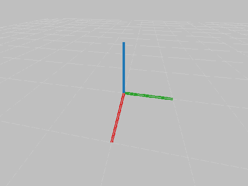

# PyPhysX - python wrapper for PhysX Nvidia
[](https://travis-ci.com/petrikvladimir/pyphysx) 
[](https://codecov.io/gh/petrikvladimir/pyphysx)

## Installation
```
pip install git+https://github.com/petrikvladimir/pyphysx.git@master
pip install --upgrade git+https://github.com/petrikvladimir/pyphysx.git@master
```

## Trivial example
```python
from pyphysx_render.renderer import PyPhysXParallelRenderer
from pyphysx_render.rate import Rate
from pyphysx import *

scene = Scene()
scene.add_actor(RigidStatic.create_plane(mat=Material(static_friction=0.1, dynamic_friction=0.1, restitution=0.5)))

actor = RigidDynamic()
actor.attach_shape(Shape.create_box([0.2] * 3, Material(restitution=1.)))
actor.set_global_pose([0.5, 0.5, 1.0])
actor.set_mass(1.)
scene.add_actor(actor)

render = PyPhysXParallelRenderer(render_window_kwargs=dict(video_filename='out.mp4'))
rate = Rate(25)
for i in range(100):
    scene.simulate(rate.period(), 10)
    render.render_scene(scene)
    rate.sleep()
```
Will render and simulate the scene and automatically generate video like this:




# Features
## Automatic video saving
Record the rendered screen and save it as a video automatically after the window is closed.
```
render = PyPhysXParallelRenderer(render_window_kwargs=dict(video_filename='out.mp4', fullscreen=True))
```