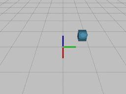

# PyPhysX - python wrapper for PhysX Nvidia
[](https://travis-ci.com/petrikvladimir/pyphysx) 
[](https://codecov.io/gh/petrikvladimir/pyphysx)

## Installation
To install for the first time:
```
pip install git+https://github.com/petrikvladimir/pyphysx.git@master
```
To update if its already installed: 
```
pip install --upgrade git+https://github.com/petrikvladimir/pyphysx.git@master
```
If pip install fails, build it from source:
```
git clone https://github.com/petrikvladimir/pyphysx.git
python setup.py install --user
```
Optionally, you can install in anaconda
```
conda create -n py38 python=3.8
conda activate py38
conda install -c anaconda gcc_linux-64 gxx_linux-64
pip install git+https://github.com/petrikvladimir/pyphysx.git@master
```

## Trivial example
```python
from pyphysx import *
from pyphysx_utils.rate import Rate
from pyphysx_render.pyrender import PyPhysxViewer

scene = Scene()
scene.add_actor(RigidStatic.create_plane(material=Material(static_friction=0.1, dynamic_friction=0.1, restitution=0.5)))

actor = RigidDynamic()
actor.attach_shape(Shape.create_box([0.2] * 3, Material(restitution=1.)))
actor.set_global_pose([0.5, 0.5, 1.0])
actor.set_mass(1.)
scene.add_actor(actor)

render = PyPhysxViewer(video_filename='videos/01_free_fall.gif')
render.add_physx_scene(scene)

rate = Rate(240)
while render.is_active:
    scene.simulate(rate.period())
    render.update()
    rate.sleep()

```
The code will render and simulate the scene and automatically generate video like this:


For more advanced examples, have a look into the folder [examples](examples/). For example:


# Features
## PhysX interface
- physics
  - PhysX allows only one instance of Physics object per process - we enforce it in PyPhysX by using singleton that is initialized on the first use
  - parallel computation control:
    - `Physics.set_num_cpu(N)` - creates CPU dispatcher with N threads
    - `Physics.init_gpu()` - initialize GPU computation
- scene
  - create scene and actors that will be simulated
  - multiple scenes can be created in parallel
- rigid actors (both static and dynamic)
  - create/attach/detach geometries (box, sphere, convex mesh)
  - create/update materials
  - set/update flags or actor properties (velocity, kinematic target, mass)
- D6Joint
  - specify per axis limits and drives
- transformations
  - automatic transformation casting between pxTransform and tuple of position and numpy quaternion (see [Transformation](doc/transformation.md))

## Rendering
Currently, there are two options for rendering: using PyRender backend or using MeshCat web-viewer.

### PyRender 
PyRender is used for pyphysx scene rendering. It allows to render shadows, support off-screen rendering and provides nice user interface.
- To record whole session into a video use:
    `render = PyPhysxViewer(video_filename='videos/02_spade.gif')`
- Viewer control:
  - mouse:
    - right button drag to rotate the scene
    - middle button to move the target location at which camera looks at
    - scroll mouse for zoom 
  - keys:
    - ``up/down/left/right``: Move the target location at which camera looks at.
    - ``PgUp/PgDn``: Zoom.
    - ``a``: Toggles rotational animation mode.
    - ``c``: Toggles backface culling.
    - ``f``: Toggles fullscreen mode.
    - ``h``: Toggles shadow rendering.
    - ``i``: Toggles axis display mode
      (no axes, world axis, mesh axes, all axes).
    - ``l``: Toggles lighting mode
      (scene lighting, Raymond lighting, or direct lighting).
    - ``m``: Toggles face normal visualization.
    - ``n``: Toggles vertex normal visualization.
    - ``o``: Toggles orthographic mode.
    - ``q``: Quits the viewer.
    - ``r``: Starts recording a GIF, and pressing again stops recording
      and opens a file dialog.
    - ``s``: Opens a file dialog to save the current view as an image.
    - ``w``: Toggles wireframe mode
      (scene default, flip wireframes, all wireframe, or all solid).
    - ``z``: Resets the camera to the initial view.

### Offscreen renderer via PyRender
Offscreen renderer shares the api with other PyPhysX viewer, i.e. has `add_physx_scene` and `update` functions.
RGB and Depth data are obtained by calling `get_rgb_and_depth()` member function.
Note, that different backend need to be used if running in headless mode (e.g. on computational cluster).
See [PyRender documentation](https://pyrender.readthedocs.io/en/latest/examples/offscreen.html) for details.
See [08_offscreen_renderer.py](examples/08_offscreen_renderer.py) example on how to use offscreen renderer.

### MeshCat
Meshcat render scene or animation in web browser.
The PyPhysx just sends the information to the server either on calling `update()` function or on calling `publish_animation()` function.
Examples of different usage of Meshcat viewer are bellow.

Online rendering:
```python
render = MeshcatViewer(wait_for_open=True, open_meshcat=True)
render.add_scene(scene)
for _ in range(100):
    scene.simulate()
    render.update()
```

Connecting to existing server:
```python
render = MeshcatViewer(zmq_url='tcp://127.0.0.1:6000')
# update as before
```

Rendering to animation and publish after rendering is done:
```python
render = MeshcatViewer(wait_for_open=True, open_meshcat=True, render_to_animation=True, animation_fps=30)
render.add_scene(scene)
for _ in range(100):
    scene.simulate()
    render.update() # will render to animation without sending information to meshcat server, i.e. is fast
render.publish_animation() # publish to the server
```

## URDF parser
- parse robot from `URDF` file
- specify joint controller and command robot
- support for full dynamic control or kinematic position or velocity control (that is standard for industrial robots), therefore you can control you robots without fine tunning PID joint controller