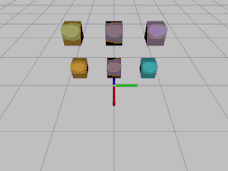

# Examples
The examples show usage of the wrapper. After running the code, you should see output similar to the animations shown bellow.

## Free fall of the cube


## Mesh loading example


## Joints example
Two rigid bodies connected by joints: 
(i) no joint on the left,
(ii) Fixed joint in the middle,
and (iii) Linear joint with damping on the right.



## Labels example
Shows how to add/update labels into the scene.


## Load URDF example
Example shows how to load simple urdf model into the physx and how to specify the joint commands in position or velocity mode.
Left example shows dynamic simulation of robot while the right one shows kinematic simulation.
The type of simulation can be specified when loading the robot.


## Load URDF Franka Emika Panda robot
Example shows both visual and collision model of the robot.


## GPU computation example
The example is split into two parts: (i) compute execution time for cpu and gpu for various scenes and (ii) plot results.
For turning on gpu computation you need to init gpu (the function initialize GPU context) and you can pass (optional) GPU settings into the scene constructor:
```
Physics.init_gpu()
Scene(scene_flags=[SceneFlag.ENABLE_PCM, SceneFlag.ENABLE_GPU_DYNAMICS, SceneFlag.ENABLE_STABILIZATION],
    broad_phase_type=BroadPhaseType.GPU, gpu_max_num_partitions=8, gpu_dynamic_allocation_scale=1.,
)
```

